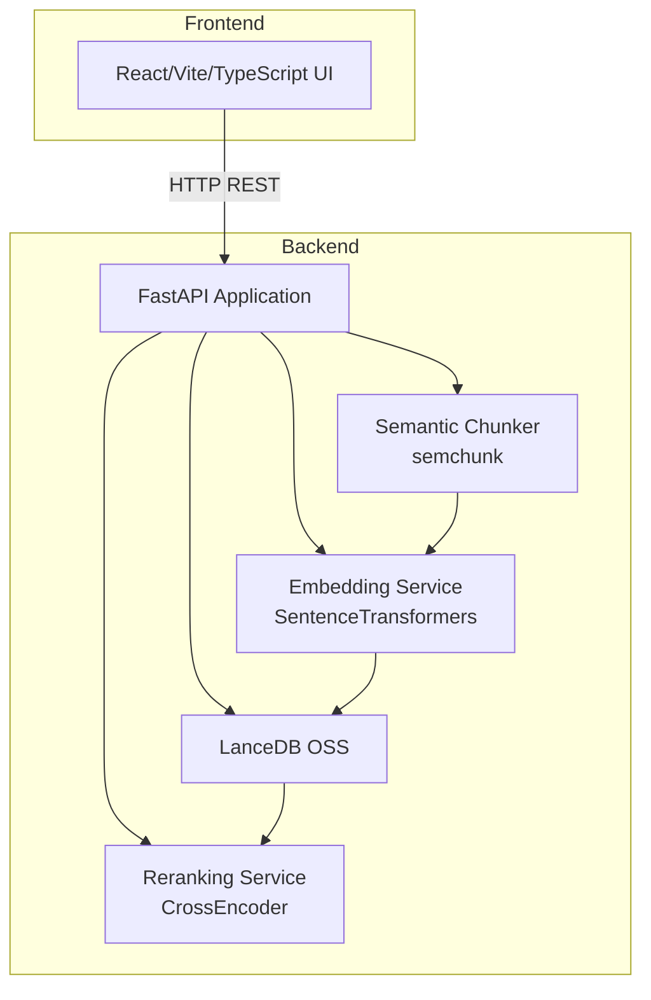

# Design Document

## Overview

This document describes the technical design for a semantic knowledge base system that provides document ingestion, semantic chunking, embedding generation, and semantic search capabilities. The system consists of a Python FastAPI backend and a React/Vite/TypeScript frontend.

The backend exposes four main API endpoints:

- `/create` - Create named indexes (tables) in the vector database
- `/encode_doc` - Encode and store a single document in a specified index
- `/encode_batch` - Batch encode documents from a directory into a specified index
- `/query` - Perform semantic search with reranking on a specified index

## Architecture



### System Flow

1. **Index Creation**: User creates a named index via `/create` endpoint
2. **Document Ingestion**: Documents are submitted to `/encode_doc` or `/encode_batch` with target index
3. **Chunking**: Documents are split into semantic chunks using semchunk library
4. **Embedding**: Chunks are encoded using Alibaba-NLP/gte-multilingual-base model
5. **Storage**: Embeddings and metadata are stored in LanceDB table
6. **Query**: User queries are embedded, searched via vector similarity, and reranked

## Components and Interfaces

### Backend Components

#### 1. FastAPI Application (`app/main.py`)

The main application entry point with CORS middleware and route registration.

```python
from fastapi import FastAPI
from fastapi.middleware.cors import CORSMiddleware

app = FastAPI(title="Semantic Knowledge Base API")

# CORS configuration for frontend
app.add_middleware(
    CORSMiddleware,
    allow_origins=["*"],
    allow_methods=["*"],
    allow_headers=["*"],
)
```

#### 2. API Routes (`app/routes.py`)

```python
from fastapi import APIRouter, HTTPException, BackgroundTasks
from pydantic import BaseModel

router = APIRouter()

class CreateIndexRequest(BaseModel):
    index_name: str

class CreateIndexResponse(BaseModel):
    index_name: str
    status: str
    message: str

class EncodeDocRequest(BaseModel):
    document_path: str
    index_name: str

class EncodeDocResponse(BaseModel):
    status: str
    chunks_created: int
    index_name: str

class EncodeBatchRequest(BaseModel):
    directory_path: str
    index_name: str

class EncodeBatchResponse(BaseModel):
    status: str
    message: str
    index_name: str

class QueryRequest(BaseModel):
    query: str
    index_name: str
    top_k: int = 5

class QueryResponse(BaseModel):
    results: list[SearchResult]
    query: str
    index_name: str

class SearchResult(BaseModel):
    id: str
    content: str
    source_document: str
    score: float
```

#### 3. Embedding Service (`app/services/embedding_service.py`)

Manages the embedding model lifecycle and provides embedding generation.

```python
from sentence_transformers import SentenceTransformer
from loguru import logger

class EmbeddingService:
    MODEL_NAME = "Alibaba-NLP/gte-multilingual-base"
    EMBEDDING_DIM = 768
    
    def __init__(self):
        self.model: SentenceTransformer | None = None
    
    def initialize(self) -> None:
        """Load the embedding model."""
        logger.info(f"Loading embedding model: {self.MODEL_NAME}")
        self.model = SentenceTransformer(self.MODEL_NAME)
        logger.info("Embedding model loaded successfully")
    
    def encode(self, texts: list[str]) -> list[list[float]]:
        """Generate embeddings for a list of texts."""
        if self.model is None:
            raise RuntimeError("Embedding model not initialized")
        return self.model.encode(texts, convert_to_numpy=True).tolist()
    
    def get_tokenizer(self):
        """Return the model's tokenizer for chunk size calculation."""
        return self.model.tokenizer
```

#### 4. Reranking Service (`app/services/reranking_service.py`)

Manages the reranking model for improving search result relevance.

```python
from sentence_transformers import CrossEncoder
from loguru import logger

class RerankingService:
    MODEL_NAME = "Alibaba-NLP/gte-multilingual-reranker-base"
    
    def __init__(self):
        self.model: CrossEncoder | None = None
    
    def initialize(self) -> None:
        """Load the reranking model."""
        logger.info(f"Loading reranking model: {self.MODEL_NAME}")
        self.model = CrossEncoder(self.MODEL_NAME)
        logger.info("Reranking model loaded successfully")
    
    def rerank(self, query: str, documents: list[str], top_k: int = 5) -> list[tuple[int, float]]:
        """Rerank documents based on query relevance."""
        if self.model is None:
            raise RuntimeError("Reranking model not initialized")
        
        pairs = [[query, doc] for doc in documents]
        scores = self.model.predict(pairs)
        
        # Return indices and scores sorted by relevance
        ranked = sorted(enumerate(scores), key=lambda x: x[1], reverse=True)
        return ranked[:top_k]
```

#### 5. Chunking Service (`app/services/chunking_service.py`)

Handles semantic text chunking using the semchunk library.

```python
import semchunk
from loguru import logger

class ChunkingService:
    DEFAULT_CHUNK_SIZE = 512
    
    def __init__(self, tokenizer=None, chunk_size: int = DEFAULT_CHUNK_SIZE):
        self.chunk_size = chunk_size
        self.chunker = None
        self.tokenizer = tokenizer
    
    def initialize(self, tokenizer) -> None:
        """Initialize the chunker with a tokenizer."""
        self.tokenizer = tokenizer
        self.chunker = semchunk.chunkerify(tokenizer, self.chunk_size)
        logger.info(f"Chunker initialized with chunk_size={self.chunk_size}")
    
    def chunk(self, text: str) -> list[str]:
        """Split text into semantic chunks."""
        if self.chunker is None:
            raise RuntimeError("Chunker not initialized")
        return self.chunker(text)
    
    def chunk_with_offsets(self, text: str) -> tuple[list[str], list[tuple[int, int]]]:
        """Split text into chunks and return offsets."""
        if self.chunker is None:
            raise RuntimeError("Chunker not initialized")
        return self.chunker(text, offsets=True)
```

#### 6. Vector Store Service (`app/services/vector_store.py`)

Manages LanceDB connections and operations.

```python
import lancedb
from lancedb.pydantic import LanceModel, Vector
from loguru import logger
import uuid

class DocumentChunk(LanceModel):
    id: str
    content: str
    embedding: Vector(768)
    source_document: str

class VectorStoreService:
    def __init__(self, db_path: str = "./data/lancedb"):
        self.db_path = db_path
        self.db = None
    
    def initialize(self) -> None:
        """Connect to LanceDB."""
        logger.info(f"Connecting to LanceDB at {self.db_path}")
        self.db = lancedb.connect(self.db_path)
        logger.info("LanceDB connection established")
    
    def create_index(self, index_name: str) -> bool:
        """Create a new table/index."""
        if self.db is None:
            raise RuntimeError("Database not initialized")
        
        if index_name in self.db.table_names():
            return False  # Index already exists
        
        self.db.create_table(index_name, schema=DocumentChunk)
        logger.info(f"Created index: {index_name}")
        return True
    
    def index_exists(self, index_name: str) -> bool:
        """Check if an index exists."""
        if self.db is None:
            raise RuntimeError("Database not initialized")
        return index_name in self.db.table_names()
    
    def add_documents(self, index_name: str, chunks: list[str], 
                      embeddings: list[list[float]], source_document: str) -> int:
        """Add document chunks to an index."""
        if self.db is None:
            raise RuntimeError("Database not initialized")
        
        table = self.db.open_table(index_name)
        records = [
            {
                "id": str(uuid.uuid4()),
                "content": chunk,
                "embedding": embedding,
                "source_document": source_document
            }
            for chunk, embedding in zip(chunks, embeddings)
        ]
        table.add(records)
        return len(records)
    
    def search(self, index_name: str, query_embedding: list[float], 
               limit: int = 20) -> list[dict]:
        """Perform vector similarity search."""
        if self.db is None:
            raise RuntimeError("Database not initialized")
        
        table = self.db.open_table(index_name)
        results = table.search(query_embedding).limit(limit).to_list()
        return results
```

### Frontend Components

#### 1. Search Interface (`src/App.tsx`)

Main React component with search functionality and index selection.

```typescript
interface SearchResult {
  id: string;
  content: string;
  source_document: string;
  score: number;
}

interface SearchState {
  query: string;
  indexName: string;
  results: SearchResult[];
  loading: boolean;
  error: string | null;
}
```

## Data Models

### LanceDB Schema

```python
from lancedb.pydantic import LanceModel, Vector

class DocumentChunk(LanceModel):
    """Schema for document chunks stored in LanceDB."""
    id: str                    # Unique identifier (UUID)
    content: str               # The text content of the chunk
    embedding: Vector(768)     # 768-dimensional embedding vector
    source_document: str       # Path or identifier of source document
```

### API Request/Response Models

```python
from pydantic import BaseModel, Field

class CreateIndexRequest(BaseModel):
    index_name: str = Field(..., min_length=1, max_length=100, 
                            pattern="^[a-zA-Z][a-zA-Z0-9_-]*$")

class EncodeDocRequest(BaseModel):
    document_path: str = Field(..., min_length=1)
    index_name: str = Field(..., min_length=1)

class EncodeBatchRequest(BaseModel):
    directory_path: str = Field(..., min_length=1)
    index_name: str = Field(..., min_length=1)

class QueryRequest(BaseModel):
    query: str = Field(..., min_length=1)
    index_name: str = Field(..., min_length=1)
    top_k: int = Field(default=5, ge=1, le=100)
```


## Correctness Properties

*A property is a characteristic or behavior that should hold true across all valid executions of a system-essentially, a formal statement about what the system should do. Properties serve as the bridge between human-readable specifications and machine-verifiable correctness guarantees.*

Based on the acceptance criteria analysis, the following correctness properties must be validated:

### Property 1: Index Creation Idempotence Check
*For any* valid index name, creating an index that already exists SHALL return an HTTP 409 conflict error, and the existing index SHALL remain unchanged.
**Validates: Requirements 1.4**

### Property 2: Invalid Index Name Rejection
*For any* string that does not match the valid index name pattern (must start with letter, contain only alphanumeric, underscore, or hyphen), the `/create` endpoint SHALL return an HTTP 400 error.
**Validates: Requirements 1.5**

### Property 3: Embedding Dimension Consistency
*For any* text input to the embedding service, the generated embedding SHALL have exactly 768 dimensions.
**Validates: Requirements 2.4, 4.2, 7.3, 8.3**

### Property 4: Chunk Size Constraint
*For any* document processed by the chunking service, each resulting chunk SHALL contain no more than the configured maximum number of tokens.
**Validates: Requirements 2.3**

### Property 5: Document Storage Integrity
*For any* document encoded via `/encode_doc`, the number of chunks stored in the index SHALL equal the number of chunks returned in the response.
**Validates: Requirements 2.5, 2.6**

### Property 6: Non-Existent Index Returns 404
*For any* request to `/encode_doc`, `/encode_batch`, or `/query` with an index_name that does not exist, the Backend API SHALL return an HTTP 404 error.
**Validates: Requirements 2.7, 3.7, 4.7, 9.3**

### Property 7: Search Results From Correct Index
*For any* query to a specific index, all returned results SHALL have source documents that were added to that specific index only.
**Validates: Requirements 4.3, 4.4**

### Property 8: Reranked Results Ordering
*For any* query result set, the results SHALL be ordered by descending reranking score, and the number of results SHALL not exceed the requested top_k.
**Validates: Requirements 4.5, 4.6**

### Property 9: Chunking Preserves Content
*For any* document, concatenating all chunks (with appropriate separators) SHALL preserve the semantic content of the original document (no content loss).
**Validates: Requirements 2.2**

## Error Handling

### HTTP Status Codes

| Status Code | Condition | Response Body |
|-------------|-----------|---------------|
| 200 | Successful query or encode operation | Operation result |
| 201 | Index created successfully | Index name and status |
| 400 | Invalid request parameters | Error message with validation details |
| 404 | Index not found, file not found, or directory not found | Error message specifying what was not found |
| 409 | Index already exists | Error message with existing index name |
| 500 | Internal server error | Error message (details logged server-side) |

### Error Response Model

```python
from pydantic import BaseModel

class ErrorResponse(BaseModel):
    error: str
    detail: str
    status_code: int
```

### Exception Handling Strategy

```python
from fastapi import HTTPException
from loguru import logger

class IndexNotFoundError(Exception):
    """Raised when a specified index does not exist."""
    pass

class IndexAlreadyExistsError(Exception):
    """Raised when attempting to create an index that already exists."""
    pass

class DocumentNotFoundError(Exception):
    """Raised when a document file is not found."""
    pass

class DirectoryNotFoundError(Exception):
    """Raised when a directory path is not found."""
    pass

# Global exception handler
@app.exception_handler(IndexNotFoundError)
async def index_not_found_handler(request, exc):
    logger.warning(f"Index not found: {exc}")
    return JSONResponse(
        status_code=404,
        content={"error": "Index not found", "detail": str(exc)}
    )

@app.exception_handler(IndexAlreadyExistsError)
async def index_exists_handler(request, exc):
    logger.warning(f"Index already exists: {exc}")
    return JSONResponse(
        status_code=409,
        content={"error": "Index already exists", "detail": str(exc)}
    )
```

## Testing Strategy

### Dual Testing Approach

The system will use both unit tests and property-based tests to ensure correctness:

1. **Unit Tests**: Verify specific examples, edge cases, and integration points
2. **Property-Based Tests**: Verify universal properties that should hold across all valid inputs

### Property-Based Testing Framework

The project will use **Hypothesis** as the property-based testing library for Python.

```python
from hypothesis import given, strategies as st, settings

# Configure minimum 100 iterations per property test
@settings(max_examples=100)
```

### Test Organization

```
backend/
├── tests/
│   ├── __init__.py
│   ├── conftest.py              # Pytest fixtures
│   ├── test_embedding_service.py
│   ├── test_chunking_service.py
│   ├── test_vector_store.py
│   ├── test_api_routes.py
│   └── properties/
│       ├── __init__.py
│       ├── test_embedding_properties.py
│       ├── test_chunking_properties.py
│       ├── test_index_properties.py
│       └── test_search_properties.py
```

### Property Test Examples

```python
# test_embedding_properties.py
from hypothesis import given, strategies as st, settings
import pytest

class TestEmbeddingProperties:
    """
    **Feature: semantic-knowledge-base, Property 3: Embedding Dimension Consistency**
    """
    
    @settings(max_examples=100)
    @given(st.text(min_size=1, max_size=1000))
    def test_embedding_dimension_consistency(self, text: str, embedding_service):
        """
        **Feature: semantic-knowledge-base, Property 3: Embedding Dimension Consistency**
        For any text input, embeddings should have exactly 768 dimensions.
        **Validates: Requirements 2.4, 4.2, 7.3, 8.3**
        """
        embeddings = embedding_service.encode([text])
        assert len(embeddings[0]) == 768


# test_index_properties.py
class TestIndexProperties:
    """
    **Feature: semantic-knowledge-base, Property 1: Index Creation Idempotence Check**
    """
    
    @settings(max_examples=100)
    @given(st.from_regex(r'^[a-zA-Z][a-zA-Z0-9_-]{0,99}$'))
    def test_duplicate_index_returns_409(self, index_name: str, vector_store):
        """
        **Feature: semantic-knowledge-base, Property 1: Index Creation Idempotence Check**
        Creating an existing index should return 409.
        **Validates: Requirements 1.4**
        """
        # First creation should succeed
        assert vector_store.create_index(index_name) == True
        # Second creation should fail
        assert vector_store.create_index(index_name) == False


# test_chunking_properties.py
class TestChunkingProperties:
    """
    **Feature: semantic-knowledge-base, Property 4: Chunk Size Constraint**
    """
    
    @settings(max_examples=100)
    @given(st.text(min_size=1, max_size=10000))
    def test_chunk_size_constraint(self, text: str, chunking_service, tokenizer):
        """
        **Feature: semantic-knowledge-base, Property 4: Chunk Size Constraint**
        Each chunk should not exceed the configured token limit.
        **Validates: Requirements 2.3**
        """
        chunks = chunking_service.chunk(text)
        for chunk in chunks:
            token_count = len(tokenizer.encode(chunk))
            assert token_count <= chunking_service.chunk_size
```

### Unit Test Examples

```python
# test_api_routes.py
import pytest
from fastapi.testclient import TestClient

class TestCreateIndexEndpoint:
    def test_create_index_success(self, client: TestClient):
        """Test successful index creation returns 201."""
        response = client.post("/create", json={"index_name": "test_index"})
        assert response.status_code == 201
        assert response.json()["index_name"] == "test_index"
    
    def test_create_index_invalid_name(self, client: TestClient):
        """Test invalid index name returns 400."""
        response = client.post("/create", json={"index_name": "123invalid"})
        assert response.status_code == 400
    
    def test_query_nonexistent_index(self, client: TestClient):
        """Test querying non-existent index returns 404."""
        response = client.post("/query", json={
            "query": "test query",
            "index_name": "nonexistent_index"
        })
        assert response.status_code == 404
```

### Test Fixtures

```python
# conftest.py
import pytest
from app.services.embedding_service import EmbeddingService
from app.services.chunking_service import ChunkingService
from app.services.vector_store import VectorStoreService

@pytest.fixture(scope="session")
def embedding_service():
    service = EmbeddingService()
    service.initialize()
    return service

@pytest.fixture(scope="session")
def chunking_service(embedding_service):
    service = ChunkingService()
    service.initialize(embedding_service.get_tokenizer())
    return service

@pytest.fixture
def vector_store(tmp_path):
    service = VectorStoreService(db_path=str(tmp_path / "test_lancedb"))
    service.initialize()
    return service
```
